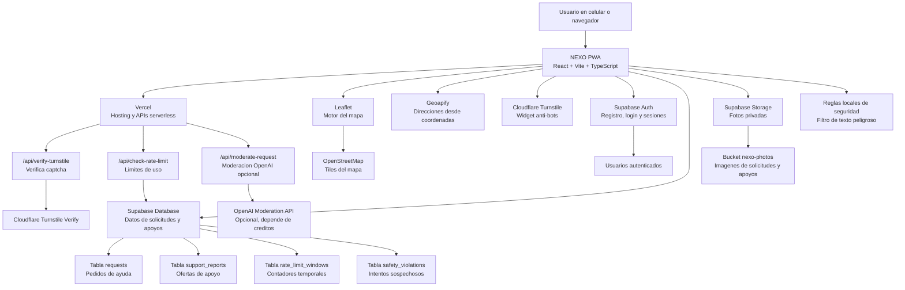
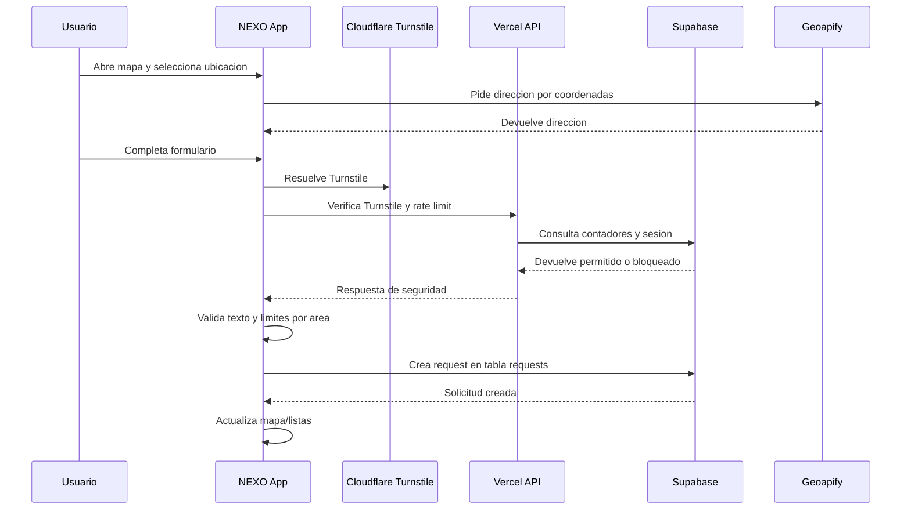

# Arquitectura de NEXO

Este documento muestra que servicios alimentan la app, para que sirve cada uno y que datos maneja. La idea es tener una vista simple antes de seguir reforzando seguridad.

## Diagrama general

## Servicios usados

| Servicio | Para que sirve en NEXO | Que datos maneja | Donde se configura |
|---|---|---|---|
| Vercel | Publica la app en internet y ejecuta APIs seguras del servidor. | Variables privadas, endpoints serverless, despliegues. | Panel de Vercel, GitHub y `api/`. |
| Supabase Auth | Registro, inicio de sesion, recuperacion de contrasena y confirmacion por correo. | Email, password cifrado por Supabase, metadata de nombre y telefono. | Supabase Authentication. |
| Supabase Database | Guarda las solicitudes, apoyos, limites y eventos de seguridad. | `requests`, `support_reports`, `rate_limit_windows`, `safety_violations`. | Supabase Table Editor y SQL files. |
| Supabase Storage | Guarda fotos subidas por usuarios. | Imagenes JPG, PNG, WebP en `nexo-photos`. | Supabase Storage policies. |
| Supabase Realtime | Actualiza mapa/listas cuando cambian solicitudes o apoyos. | Cambios en `requests` y `support_reports`. | SQL realtime y Supabase Realtime. |
| Cloudflare Turnstile | Reduce bots antes de registrar, pedir ayuda u ofrecer apoyo. | Token temporal de verificacion, no guarda solicitudes. | Cloudflare y variables Vercel. |
| Geoapify | Convierte coordenadas GPS o cruz del mapa en direccion legible. | Latitud/longitud enviadas para obtener direccion. | `VITE_GEOAPIFY_API_KEY`. |
| Leaflet | Dibuja el mapa, pines y clusters en la app. | Coordenadas y pines visibles en navegador. | Codigo frontend `MapScreen`. |
| OpenStreetMap | Provee los tiles visuales del mapa. | Solicitudes de tiles segun zona visible del mapa. | Leaflet tile layer. |
| OpenAI Moderation API | Opcional para revisar texto peligroso o ilegal. Actualmente puede estar desactivado si no hay creditos. | Texto de solicitudes o apoyos enviado al endpoint serverless. | `OPENAI_API_KEY` y `OPENAI_MODERATION_ENABLED`. |
| Reglas locales de seguridad | Filtro gratis para detectar palabras y combinaciones peligrosas. | Texto escrito por usuario en el navegador. | `src/services/moderationService.ts` y `safetyService.ts`. |

## Bases y tablas principales

### `requests`

Guarda cada pedido de ayuda.

Campos importantes:

- `category`: categoria principal, por ejemplo Agua, Rescate, Medicamentos.
- `item`: subcategoria o articulo solicitado.
- `description`: detalle escrito por el usuario.
- `latitude` y `longitude`: ubicacion del pin.
- `address`: direccion detectada.
- `status`: `pending` o `resolved`.
- `partial_support`: indica si recibio ayuda parcial.
- `created_by`: usuario que creo la solicitud.
- `requester_name`, `requester_phone`, `requester_anonymous`: datos del solicitante.
- `photo_url`: ruta de foto si existe.

### `support_reports`

Guarda cuando una persona ofrece apoyo.

Campos importantes:

- `request_id`: solicitud que recibira apoyo.
- `supporter_id`: usuario que ofrece apoyo.
- `supporter_name`, `supporter_phone`, `anonymous`: datos visibles solo donde corresponde.
- `details`: detalle del apoyo ofrecido.
- `status`: `pending_confirmation`, `confirmed`, `rejected`, `partial` o `expired`.
- `photo_url`: foto opcional del apoyo.

### `rate_limit_windows`

Guarda contadores temporales para frenar abuso.

Ejemplos:

- Crear cuentas por email/IP.
- Crear solicitudes por usuario/IP.
- Controlar apoyos pendientes.

### `safety_violations`

Registra intentos sospechosos o textos bloqueados. Sirve para bloquear cuentas despues de varios intentos.

## Variables de entorno importantes

| Variable | Donde vive | Para que sirve |
|---|---|---|
| `VITE_SUPABASE_URL` | Vercel frontend | URL publica del proyecto Supabase. |
| `VITE_SUPABASE_ANON_KEY` | Vercel frontend | Llave publica para usar Supabase desde el navegador con RLS. |
| `SUPABASE_SERVICE_ROLE_KEY` | Vercel servidor | Llave privada para endpoints serverless. Nunca debe ir al frontend. |
| `RATE_LIMIT_ENABLED` | Vercel servidor | Activa o desactiva el rate limit. Debe estar en `true` en produccion. |
| `VITE_AUTH_REDIRECT_URL` | Vercel frontend | URL final a donde vuelven links de confirmacion y recuperacion. |
| `VITE_GEOAPIFY_API_KEY` | Vercel frontend | Mejora direcciones detectadas por GPS/mapa. |
| `VITE_TURNSTILE_SITE_KEY` | Vercel frontend | Clave publica del widget Turnstile. |
| `TURNSTILE_SECRET_KEY` | Vercel servidor | Clave privada para verificar Turnstile. |
| `OPENAI_API_KEY` | Vercel servidor | Clave privada para moderacion OpenAI opcional. |
| `OPENAI_MODERATION_ENABLED` | Vercel servidor | `true` usa OpenAI, `false` usa solo reglas locales. |

## Flujo actual de una solicitud

## Punto importante de seguridad

La app valida Turnstile, rate limit, texto peligroso y limites de area antes de escribir. Ademas, las acciones principales ya pasan por una API serverless de Vercel: `/api/request-actions`.

Estas acciones criticas ahora se escriben desde servidor:

- Crear solicitud.
- Ofrecer apoyo.
- Confirmar apoyo.
- Cancelar pedido.

Asi el servidor valida sesion, limites y propiedad antes de escribir en Supabase. Eso reduce el riesgo de que alguien intente saltarse la app y llamar Supabase directamente.

Pendientes para una capa mas estricta:

- Mover la verificacion de Turnstile completamente dentro de `/api/request-actions`.
- Mover expiracion de apoyos y borrado de datos de cuenta a APIs serverless.
- Revisar politicas RLS para limitar escrituras directas desde el navegador.

## Resumen rapido

- Vercel mantiene la app viva y protege funciones privadas.
- Supabase guarda usuarios, solicitudes, apoyos, fotos y limites.
- Cloudflare Turnstile reduce bots.
- Geoapify convierte coordenadas en direcciones.
- Leaflet/OpenStreetMap muestran el mapa.
- Reglas locales y OpenAI opcional ayudan a bloquear contenido peligroso.
